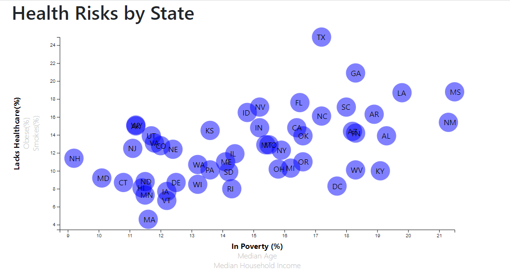

# Health Risks Visualizaton
This visualization uses D3.js to create an interactive scatterplot. Data is from the United States [census website](https://factfinder.census.gov/faces/nav/jsf/pages/searchresults.xhtml "Census Fact Finder search"). Each state has a circle on the plot bound with data for 6 different factors. Three health risk factors are plotted on the y-axis and three demographic measurements are plotted on the x-axis. 

Clicking on any of the axis labels will update the plot to show that factor, thus allowing easy transition between nine different scatterplots. 

